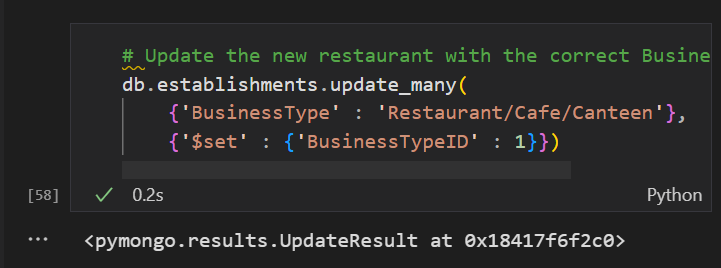
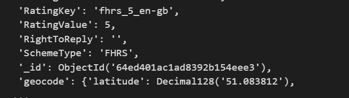
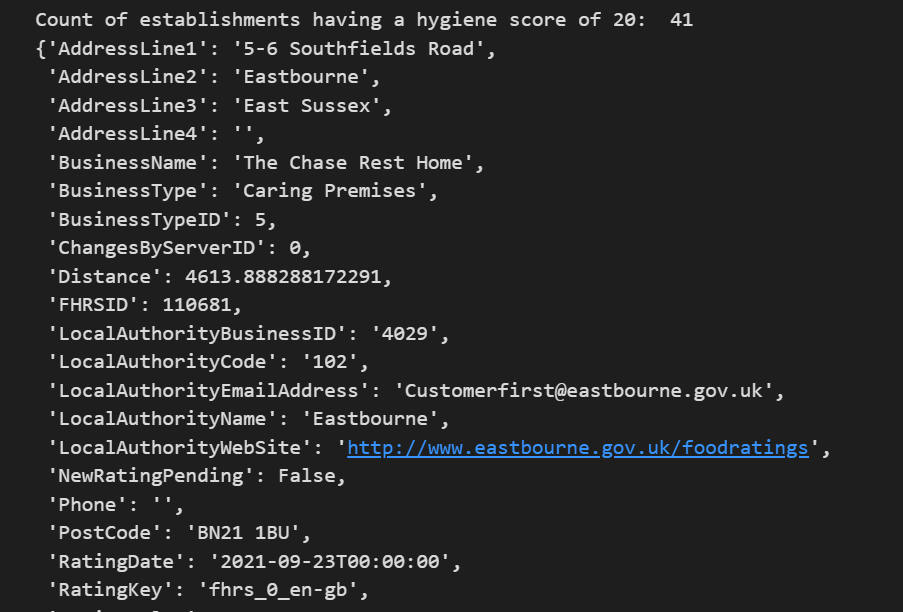
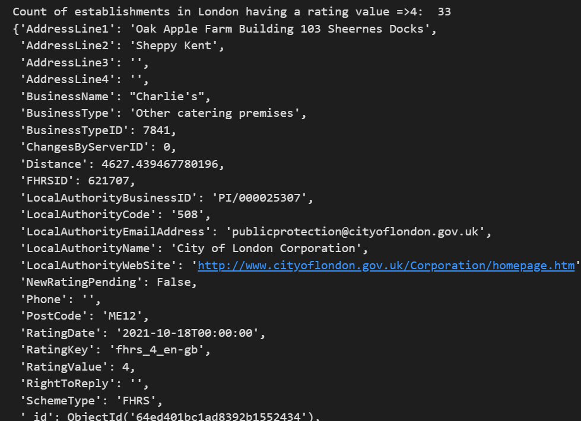
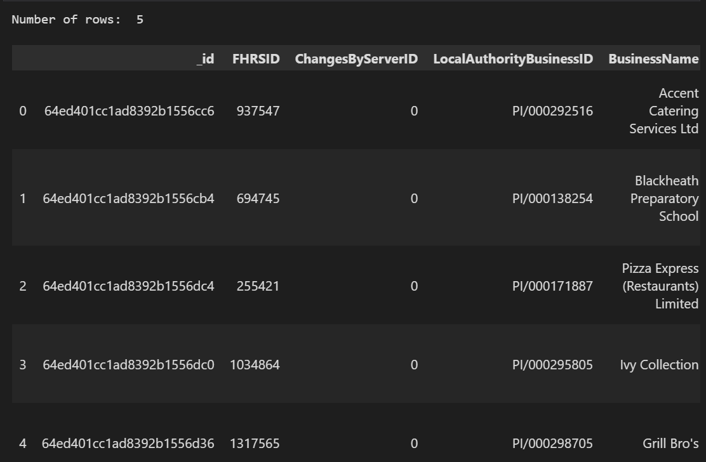
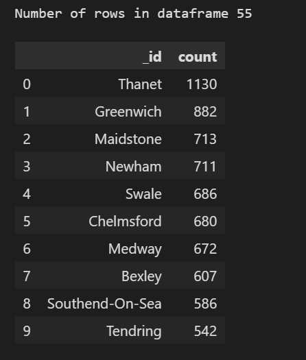

# Eat Safe, Love: NoSQL Challenge

This repository documents the analysis conducted for the magazine Eat, Safe, Love, which involved evaluating restaurant ratings published by the UK Food Standards Agency across the United Kingdom.

## Part 1: Database Setup and Jupyter Notebook Initialization

1. **Data Import and Database Setup**
   - The data from `establishments.json` was imported via the Terminal.
   - The database was named `uk_food`, and the collection was named `establishments`.
   - The import command used:
     ```bash
     mongoimport --db uk_food --collection establishments --drop --file mongoimport --db uk_food --collection establishments --drop --file .\establishments.json --jsonArray
     ```

2. **Libraries Import and Mongo Client Initialization**
   - PyMongo and Pretty Print libraries were imported.
   - A Mongo Client instance was created.

3. **Database and Collection Assignment**
   - The `uk_food` database was assigned to a variable.
   - The `establishments` collection within the database was assigned to a variable.

## Part 2: Database Updates

1. **Insertion of Restaurant Data**
   - Created a dictionary for the restaurant named `Penang Flavours`.
   - Used `insert_one()` to add the data to the `establishments` collection.

2. **Updating Business Type ID**
   - Determined the Business Type ID for `Restaurant/Cafe/Canteen`.
   - Updated the `Penang Flavours` entry with the corresponding Business Type ID.

   

3. **Deletion of Establishments in Dover**
   - Located and removed all establishments in Dover from the collection.
   - Initial count: 994 establishments. After deletion: 0 establishments.

4. **Conversion of Coordinates to Decimal and Rating to Int**
   - Used `update_many()` to convert latitude and longitude values from strings to decimal numbers.

   

## Part 3: Exploratory Data Analysis

1. **Hygiene Score of 20**
   - Queried establishments with a hygiene score of 20.
   - Used `count_documents()` to determine there are 41 such establishments.

   

2. **Rating Value in London ≥ 4**
   - Searched for establishments in London with a rating value greater than or equal to 4.
   - Identified 33 establishments meeting this criteria.

   

3. **Top 5 Establishments with Rating Value 5**
   - Calculated the latitude and longitude variables based on Penang Flavours' location.
   - Sorted establishments with a rating value of 5 by lowest hygiene score, nearest to Penang Flavours.
   - Displayed the top 5 closest establishments.

   

4. **Hygiene Score 0 by Local Authority Area**
   - Created a query to identify establishments with a hygiene score of 0.
   - Grouped establishments by Local Authority Area and counted occurrences.
   - Displayed the 10 local authority areas with the most establishments having a hygiene score of 0.

   